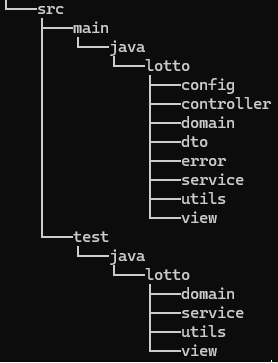

# 로또

## 프로젝트 개요

우리가 흔히 아는 6/45 로또를 구현한다. 다만 일반적인 로또와 차이점이 존재한다. 일반적으로는 사용자로부터 로또 번호를 입력 받은 후, 당첨 번호와 보너스 번호를 시스템 상으로 만들어 당첨 결과를 반환한다.
하지만 우리가 구현하는 로또는 로또의 금액을 받아, 그 금액 만큼 시스템에서 로또를 자동으로 생성해주고, 당첨 번호와 보너스 번호를 사용자로부터 입력 받는다.

사용자로 부터 받은 당첨 번호와 보너스 번호를 바탕으로, 시스템이 만든 로또와 검증하여, 당첨 결과와 수익률 현황(로또 구매 비용 대비 당첨금)을 사용자에게 출력해서 보여준다.

## 기능 목록

### 입력

- [x]  로또 가격 입력 받기
    - [x]  정수가 아닌 경우 에러 발생
    - [x]  1000원으로 나누어 떨어지지 않는경우 에러 발생
    - [x]  10만원이 넘어가는 경우 에러 발생
    - [x]  0 또는 음수일 경우 에러 발생
- [x]  당첨 번호 입력 받기(쉼표(,)로 구분)
    - [x]  정수가 아닌 경우 에러 발생
    - [x]  6개의 번호가 아닌 경우 에러 발생
    - [x]  중복된 숫자가 있는 경우 에러 발생
    - [x]  1 ~ 45 사이의 숫자가 아닌 경우 에러 발생
- [x]  보너스 번호 입력 받기
    - [x]  정수가 아닌 경우 에러 발생
    - [x]  당첨 번호와 중복되는 경우 에러 발생
    - [x]  1 ~ 45 사이의 숫자가 아닌 경우 에러 발생

### 비지니스 로직

- [x]  로또 가격에 따른 개수 구하기
- [x]  로또 만들기
    - [x]  6개의 번호가 아닌 경우 에러 발생
    - [x]  중복된 숫자가 있는 경우 에러 발생
    - [x]  1 ~ 45 사이의 숫자가 아닌 경우 에러 발생
    - [x]  로또 번호 오름차순으로 정렬하기
    - [x]  1 ~ 45 사이의 중복되지 않는 6개의 숫자 생성하기
- [x]  로또 수량에 맞는 로또들 만들기
- [x]  로또들이 몇 개 일치하는지 체크하는 기능 만들기
- [x]  총 수익률 계산하기(소수점 둘째 자리에서 반올림)

### 출력

- [x]  발행한 로또 수량 및 번호 출력하기(오름차순)
- [x]  당첨 내역 출력하기
- [x]  수익률 출력하기(소수점 둘째 자리에서 반올림)
- [x]  예외 상황시 에러 문구 출력하기(에러 문구는 “[ERROR]”로 시작해야 한다.”)

## 패키지 구조

- config: 환경 설정과 관련된 폴더 ex) 의존성 주입 설정
- controller: 외부로 부터 가장 처음으로 요청을 받는 곳
- domain: 엔티티들을 모아둔 곳 ex) Lotto class, Rank class
- dto: 외부와 controller 사이에서 데이터를 주고 받기 위함
- error: 에러 메시지를 모아둔 곳
- service: 실제 비지니스 로직이 실행되는 곳
- utils: 범용적으로 사용할 수 있는 곳 ex) RandomNumberGenerator
- view: 사용자에게 데이터를 입출력 하는 곳
